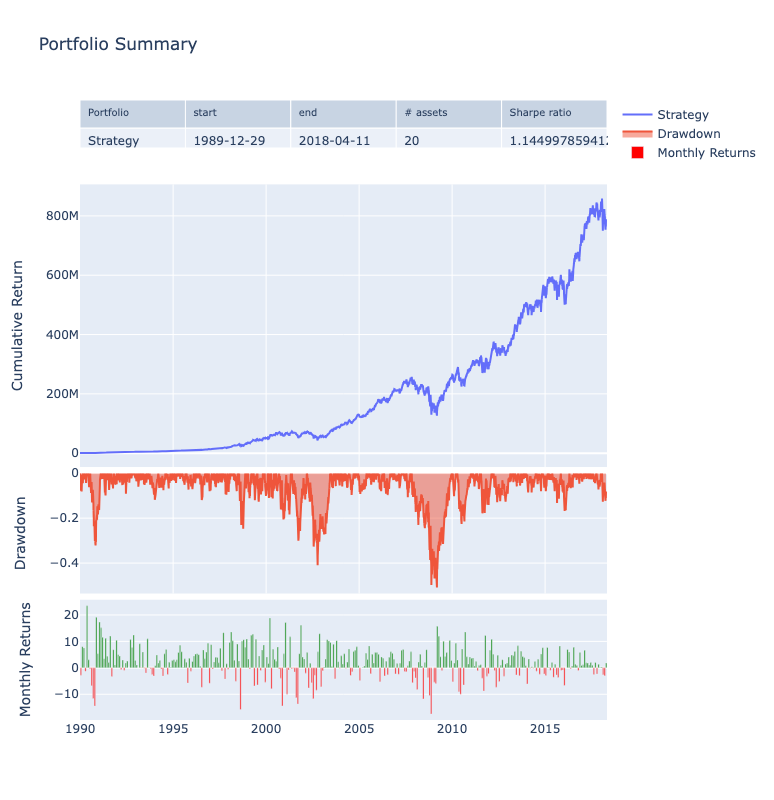

# [cvxsimulator](https://www.cvxgrp.org/simulator/)

[](https://badge.fury.io/py/cvxsimulator)
[](https://github.com/cvxgrp/simulator/blob/master/LICENSE)
[](https://pypi.python.org/pypi/cvxsimulator/)
[](https://coveralls.io/github/cvxgrp/simulator?branch=main)

[](https://codespaces.new/cvxgrp/simulator)

Given a universe of $m$ assets we are given prices for each of them at
time $t_1, t_2, \ldots t_n$, e.g. we operate using an $n \times m$ matrix where
each column corresponds to a particular asset.

In a backtest we iterate in time (e.g. row by row) through the matrix and
allocate positions to all or some of the assets. This tool shall help to
simplify the accounting. It keeps track of the available cash,
the profits achieved, etc.

## Creating portfolios

The simulator shall be completely agnostic as to the trading policy/strategy.
Our approach follows a rather common pattern:

* [Create the builder object](#create-the-builder-object)
* [Loop through time](#loop-through-time)
* [Build the portfolio](#build-the-portfolio)

We demonstrate those steps with somewhat silly policies.
They are never good strategies, but are always valid ones.

Of course, some users may know prices and weights in advance.
In that case, the building procedure can be bypassed.
We discuss this in

* [Bypassing the builder](#bypassing-the-builder)

### Create the builder object

The user defines a builder object by loading a frame of prices
and initialize the amount of cash used in our experiment:

```python
from pathlib import Path

import pandas as pd
from cvx.simulator.builder import builder

prices = pd.read_csv(Path("resources") / "price.csv",
                     index_col=0, parse_dates=True, header=0).ffill()
b = builder(prices=prices, initial_cash=1e6)
```

It is also possible to specify a model for trading costs.
The builder helps to fill up the frame of positions. Only once done
we construct the actual portfolio.

### Loop through time

We have overloaded the `__iter__` and `__setitem__` methods
to create a custom loop. Let's start with a first strategy. Each day we choose
two names from the universe at random. Buy one (say 0.1 of your
portfolio wealth) and short one the same amount.

```python
for t, state in b:
    # pick two assets at random
    pair = np.random.choice(b.assets, 2, replace=False)
    # compute the pair
    stocks = pd.Series(index=b.assets, data=0.0)
    stocks[pair] = [state.nav, -state.nav] / state.prices[pair].values
    # update the position
    b[t[-1]] = 0.1 * stocks
```

Here t is the growing list of timestamps, e.g. in the first iteration
t is $t1$, in the second iteration it will be $t1, t2$ etc.

A lot of magic is hidden in the state variable.
The state gives access to the currently available cash, the current prices
and the current valuation of all holdings.

Here's a slightly more realistic loop. Given a set of $4$ assets we want to
implmenent the popular $1/n$ strategy.

```python
for t, state in b:
    # each day we invest a quarter of the capital in the assets
    b[t[-1]] = 0.25 * state.nav / state.prices
```

Note that we update the position at the last element in the t list
using a series of actual stocks rather than weights or cashpositions.
The builder class also exposes setters for such alternative conventions.

```python
for t, state in b:
    # each day we invest a quarter of the capital in the assets
    b.set_weights(t[-1], pd.Series(index=b.assets, data = 0.25))
```

### Build the portfolio

Once finished it is possible to build the portfolio object

```python
portfolio = b.build()
```

### Bypassing the builder

Some may know the positions the portfolio shall enter for eternity.
Running through a loop is rather non-pythonic waste of time in such a case.
It is possible to completely bypass this step by submitting
a frame of positions together with a frame of prices when creating the
portfolio object.

```python
from pathlib import Path

import pandas as pd
from cvx.simulator.portfolio import EquityPortfolio

prices = pd.read_csv(Path("resources") / "price.csv",
                     index_col=0, parse_dates=True, header=0).ffill()
stocks = pd.read_csv(Path("resources") / "stock.csv",
                     index_col=0, parse_dates=True, header=0)
portfolio = EquityPortfolio(prices=prices, stocks=stocks, initial_cash=1e6)
```

## Analytics

The portfolio object supports further analysis and exposes
a number of properties, e.g.

```python
portfolio.nav
portfolio.cash
portfolio.equity
```

We have also integrated the [quantstats](https://github.com/ranaroussi/quantstats)
package for further analysis. Hence it is possible to perform

```python
portfolio.snapshot()
portfolio.metrics()
portfolio.plots()
portfolio.html()
```

We also added an enum

```python
portfolio.plot(kind=Plot.DRAWDOWN)
```

supporting all plots defined in quantstats.



## Poetry

We assume you share already the love for [Poetry](https://python-poetry.org).
Once you have installed poetry you can perform

```bash
poetry install
```

to replicate the virtual environment we have defined in pyproject.toml.

## Kernel

We install [JupyterLab](https://jupyter.org) within your new virtual
environment. Executing

```bash
make kernel
```

constructs a dedicated [Kernel](https://docs.jupyter.org/en/latest/projects/kernels.html)
for the project.
